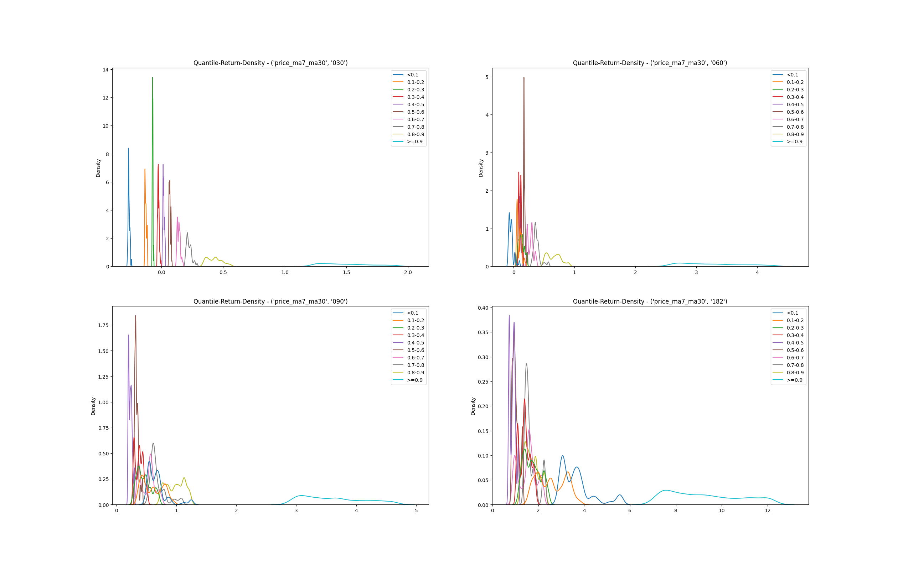

# Predictive Boosting DCA

The goal of this project is to design a dynamic Dollar-Cost-Average strategy, which adopts long-only method, helping accumulate as much bitcoins as it could, and significantly outperforming passive uniform DCA strategy.
While the ultimate purpose of analytics is to give predictive signals, helping not only in accumulating, but also in trading transactions, it is temping to develop a model which could ouput credible future price/return forcasts. 

In this project, I have developed two models to predict future return. One is a simple linear regression method, the other uses Mamba achietecture as basic blocks of a 4-layers deep learning model. Then the algorithms use predicted results either as signal, or as booster of uniform weights.

**NOTE** 

Extra packages installations are needed to run backtest. Screen shots of backtest were saved in 'model/output_LinReg' and 'model/output_mamba' in case when readers are unwilling to install them.

---

## Backtest results

1.  **Linear Regression method**
    ```bash
    python -m model.LinReg_backtest
    ```
    

    This simplest predictive method gets **50.29%** win rate, which is not very different from uniform strategy. All backtest ouputs were saved in folder 'model/output_LinReg'.

2.  **Mamba based deep learning method**
    ```bash
    python -m model.mamba_backtest
    ```

    

    This method outputs far more reliable signals and gets **66.45%** win rate. To further improve it, finer retraining interval and/or finding other informative signal could be viable direction. All backtest ouputs were saved in folder 'model/output_mamba'.

## Extra packages installation

1.  **For EDA and Linear Regress method**
    
    yfinance==1.1.0

    ipykernel==7.1.0

    statsmodels==0.14.6

    scikit-learn==1.8.0

    hmmlearn==0.3.3

2.  **For mamba method**
    
    torch==2.11.0

    mamba_ssm==2.3.1

    Please note 'mamba_ssm' installation needs Linux system and cuda available.

## Mamba Method Explaination

1.  **Model Achietecture**
    ```text
    ├── Input projection layer           # 16 -> 256 dims
    ├── Basic blocks * 4                 # 4 layers of repeated basic blocks
    │   ├── Mamba                        # from mamba_ssm
    │   ├── Dropout                      # dropout=0.1
    │   └── LayerNorm                    # LayerNorm is helpful while BatchNorm is not    
    ├── Average Pooling                  # lambda x: x.mean(dim=1)
    ├── Head                             # output layer
    │   ├── Linear                       # 256 -> 256
    │   ├── Relu                         # regularization
    │   ├── Dropout                      # dropout=0.1
    └── └── Linear                       # 256 -> 4   
    ```

2.  **Features Slection & Target Horizons**

    ```python
    FEATS = {
            'tech': ['RSI', 
                    'Mayer_multiple',
                    'Volume'],
            'onchain': ['price_vs_ma',
                        'price_ma7_ma30',
                        'price_ma30_ma90',
                        'HashRate_ma7_ma30',
                        'HashRate_ma30_ma90',
                        'AdrBalCnt_ma7_ma30',
                        'AdrBalCnt_ma30_ma90',
                        'mvrv_zscore',
                        'price_ma7_ma30_gradient',
                        'price_ma30_ma90_gradient'],
            'poly': ['btc_sentiment',
                    'rate_up_market_count',
                    'rate_down_market_count']
            }
    HORIZONS = ['return_030d',
                'return_060d', 
                'return_090d', 
                'return_120d']
    ```
    Technical features are computed on yahoo finance dataset, which could be downloaded by 'data/yfinance/yf_download.py'. OnChain features are computed on Coinmetrics dataset, and Poly features on polymarket dataset. Targets are future returns if buy at today's price, in 4 horizons.

3.  **Training Data Structure & Models Periodical Coverage**
    
    (1) Organized x_train, x_val, and x_test:

    For the time series dataset training task, data structure should be in a info-leakage-preventing manner, for example, the data feed into model name 'model/checkpoint/model_2018-12-31.pt' should be: (see function 'load_data' in model/mamba.py)
    ```python
    N = len(pd.date_range('2010-07-18','2018-12-31'))
    n_test = max(int(N * test_ratio), 365)
    n_val = int(N * val_ratio)
    n_train = N - n_val - n_test

    X_train, Y_train = X[:n_train], Y[:n_train]
    X_val, Y_val = X[n_train: n_train + n_val - 120], Y[n_train: n_train + n_val - 120]
    X_test, Y_test = X[n_train + n_val:], Y[n_train + n_val:]
    ```
    
    Please note that the last 365 steps data never involved in training nor in model selection. And the 120 steps before test data are masked as well since my longest target horizon is 120 days return. 

    (2) For every test window [start_date: end_date], call relevant pretrained model to predict signal:

    ```text
    end_date < 2018-12-31 --> model_2018-12-31.pt
    end_date < 2019-06-30 --> model_2019-06-30.pt
    end_date < 2019-12-31 --> model_2019-12-31.pt
    ...
    ```
    (3) Signals are formatted as  {start_date:np.ndarray of 365 signals}, for instance:
    ```text
    {'2018-01-01': [365 signals]}
    {'2018-01-02': [365 signals]}
    ...
    ```
    (4) Since the signals are computed in a rolling manner, below backtest functions are revised accordingly:
    ```text
    backtest_template_mamba.py --> copied from backtest_template.py
            (run_full_analysis)
    prelude_template_mamba.py --> copied from prelude_template.py
            (check_strategy_submission_ready, backtest_dynamic_dca, compute_cycle_spd)
    ```

4.  **Prediction Quality**

    ```bash
    python -m model.template_mamba
    ```

    

    | Metrics |  30d   |  60d  |  90d  |  120d |
    |---------|--------|-------|-------|-------|
    | MSE | 3.2640838e-03 | 2.4250933e-04 | 1.5079099e-04 | 9.9083205e-05 |
    | MAE | 2.4871876 | 2.7896104 | 1.9521879 | 1.036711 |
    | Direction Accuracy | 0.57798165 | 0.72247706 | 0.71330275 | 0.90825688 |

    The model predicts future returns based on historical features with sequence length of 128 time steps. So it is expected that the 120d horizon reports best metrics. And this design is intended since we are adopting long-only philosophy. 

    In back-testing stage, we choose predictions on 120d horizon as signal. We set a threshold that when |signal| > 0.05, it is regarded as credible signal and be added on uniform weight as booster or negator after multiplied by 2. Statiscally, uniform DCA strategy copes well with volatile assets. Predictive signals alone could not beat uniform method. 

## Possible Further Improvements

1.  **Paradigm Shift Detection**

    Run below bash command, the custom-backtest function cares about the history Mamba method competing with Uniform strategy. The vertical dash line represent the time we periodically switch pre-trained models.

    ```bash
    python -c 'from model.mamba_backtest import custom_backtest; custom_backtest()'
    ```

    

    It is observed that the win-loss-territory-changes happened mostly just at the time when we periodically switched models. In almost all test window which starts one day in year 2020, the proposed strategy failed . The reason of this should be investigated carefully. Two possibilities worth a try: (1) Train models more frequently, say, per month. (2) Introduce other boosters or negators.

    And it is interesting to observe that this kind of paradigm shifts are quite similar to those captured by Hidden Markov Model. My model performs good in state 0 and struggles in state 1:

    ```bash
    python -c 'from model.utils import hmm_state; hmm_state()'
    ```

    

2.  **Quantile-Layered returns of select features**

    Some features, such as ['HashRate_ma7_ma30', 'RSI', 'mvrv_zscore', 'price_ma7_Ma30'], when fell into extreme quantiles (below 0.1 or above 0.9), are strong indicators of future return.

    ```bash
    python -c 'from model.utils import plot_quantile_return_density; 
                from model.LinReg import _prepare_dataset, compute_quantile_winrate; 
                x, y = _prepare_dataset(); 
                lag_res, quantiles = compute_quantile_winrate(x, y); 
                plot_quantile_return_density(lag_res, "price_ma7_ma30")'
    ```

    

    These features could be used to construct credible booster/negator signals when they fell into extreme quantiles. And hopefully this direction will improve strategy performance further.

## END